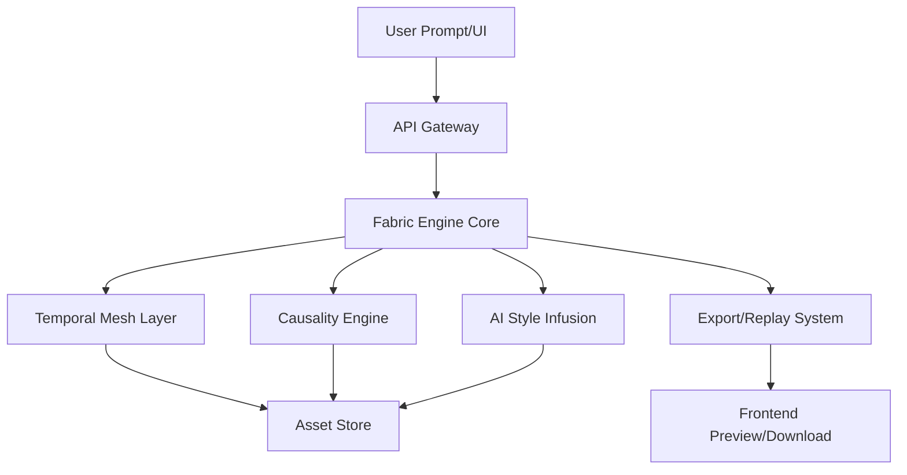

# Realis Fabric Engine (RFE) – Project Blueprint

---

## 1. System Overview

**Realis Fabric Engine (RFE)** is a next-generation 4D+ simulation and rendering engine, capable of generating, evolving, and simulating 3D assets and worlds across time, with deep AI integration for style, physics, and narrative.  
It’s not just a renderer; it’s a universe composer and living data fabric.

---

## 2. Architecture



---

## 3. Component Breakdown

### A. Fabric Engine Core
- Orchestrates all modules: receives user input, handles time scrubbing, event injection, style morphing.

### B. Temporal Mesh Layer
- Stores geometry and state for all objects *across time*.
- Provides methods for time navigation, interpolation, branching, and merging of states.

### C. Causality Engine
- Accepts events (user-defined, AI-generated, or procedural).
- Simulates consequences, updates meshes and timelines, maintains causal history graph.

### D. AI Style Infusion
- Uses LLM/ML models for:
  - Style transfer (realistic, abstract, painterly, etc.)
  - Material evolution (rust, weathering, growth, etc.)
  - Narrative overlays (“evolve this city after a flood”)

### E. Export & Replay System
- Exports:
  - Static models (at any time point)
  - Animated sequences (any timeline interval)
  - 4D asset packs (full history + causality/events)
- Preview in browser (Three.js/WebGL/GLTF viewer)

### F. Frontend/UI
- **Fabric Timeline**: Visualizes object/world history, events, and style changes.
- **Causality Canvas**: Drag/drop events, edit timeline, view ripple effects.
- **Inspector**: For deep-diving into object history, properties, and memory.

---

## 4. Data Models

### A. FabricObject
```json
{
  "id": "uuid",
  "name": "string",
  "geometry": {...},
  "material": {...},
  "timeline": [
    {
      "timestamp": "float",
      "state": {...},
      "events": [...]
    }
  ],
  "causal_links": [
    {
      "event_id": "uuid",
      "effect_on": "FabricObject.id"
    }
  ]
}
```

### B. Event
```json
{
  "id": "uuid",
  "type": "string",
  "parameters": {...},
  "timestamp": "float",
  "targets": ["FabricObject.id"]
}
```

---

## 5. API Endpoints

- `POST /fabric/object` – Create new object (prompt, style, timeline)
- `GET /fabric/object/:id` – Fetch full object timeline/data
- `POST /fabric/event` – Inject event (causal or style) at timestamp
- `POST /fabric/style` – Apply AI style to object or whole scene
- `GET /fabric/export` – Export current state/animation/fabric
- `POST /fabric/branch` – Fork timeline from any point

---

## 6. Example Workflows

### A. Evolving Object
1. User prompts: “Generate a futuristic tree that grows and glows over 10 years.”
2. Engine builds geometry, simulates growth timeline, applies AI “glow” style.
3. User injects “lightning strike” event at year 5.
4. Engine burns/scars mesh, updates timeline, logs event.
5. User exports tree at year 10, or replays full timeline as an animation.

### B. World Branching
1. User generates city, scrubs to year 20, injects “flood event.”
2. Branches world: one with flood, one without.
3. Exports both versions for use in game, animation, or research.

---

## 7. Future-Proofing/Extension

- **Plugin support** for custom physics, AI models, file formats.
- **Distributed rendering/simulation** for overclock mode.
- **Multi-user collaboration** (live or turn-based).
- **VR/AR streaming** of living “fabric” worlds.

---

## 8. Task Breakdown (for Sprints)

### Sprint 1: Scaffold Core
- Set up monorepo/project structure.
- Implement base FabricObject and Timeline data models.
- Build basic API endpoints (create/read/update object/timeline).
- Simple Three.js frontend for static/animated preview.

### Sprint 2: Causality Engine
- Design Event model, causal graph, and effect propagation logic.
- UI for timeline/event injection.

### Sprint 3: AI Style Integration
- Integrate LLM/codegen for style/material mutation.
- Add UI for style selection and style timeline.

### Sprint 4: Export & Replay
- Build export system (GLTF, OBJ, MP4, 4D archive).
- Add frontend replay, scrubber, and download.

### Sprint 5+: Extension
- Add plugin hooks for physics, AI, collaboration.
- Overclock mode: hardware scaling, distributed jobs.

---

## 9. Pseudocode Example: Event Propagation

```python
def apply_event(fabric_object, event, timestamp):
    # Find nearest timeline state
    state = fabric_object.timeline.find_nearest(timestamp)
    # Apply event effect
    new_state = event.apply_to(state)
    # Append to timeline
    fabric_object.timeline.append({"timestamp": timestamp, "state": new_state, "events": [event.id]})
    # Propagate effects
    for link in fabric_object.causal_links:
        if link.event_id == event.id:
            apply_event(link.effect_on, event, timestamp)
```

---

## 10. Diagrams & Visuals

**Fabric Timeline Example**  
```
[Seed]---grow--->[Sapling]---grow--->[Tree]---event:Lightning--->[Burnt Tree]
```

**Causality Canvas Example**
```
[Building] <--Earthquake-- [Timeline]
              |
           [Flood]
              |
         [Ruined City]
```

---

## END SPEC
